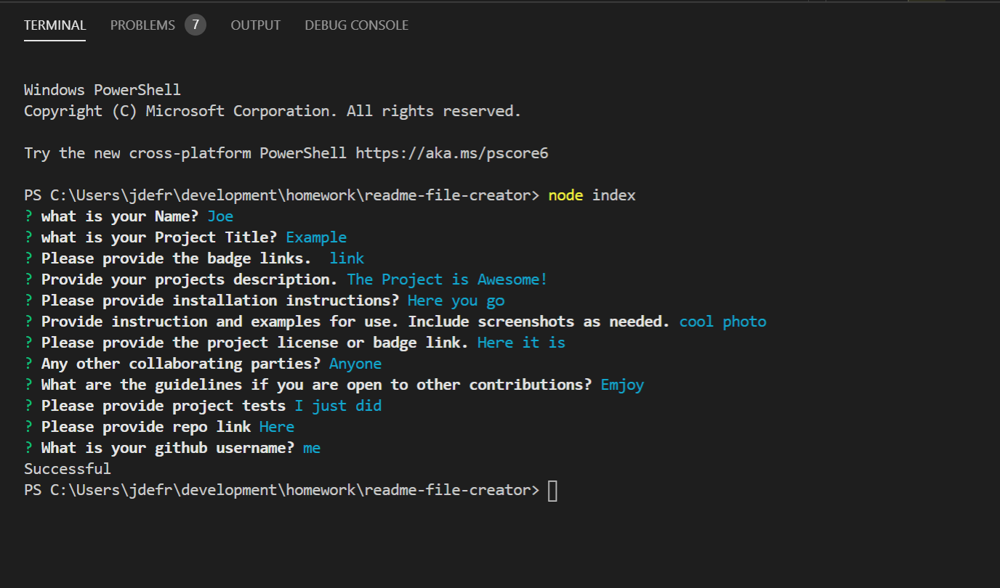
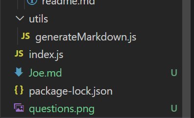

## ReadMe File Creator

For this task, I have worked to develop a readme generator. The purpose is to simplify read me files and saving the user some additional time. By using node.js, I am creating an application for the everyday coder. 

The Terminal asks a series of questions that the user should answer for a proper read me file. 

Once completed you will see in your folder a new read me based on your project title!

From there you can adjust anything you would like to on the read me and use it to your advantage. If anyone would like to adjust the code or work to create it to there liking go right ahead. I appreciate any contributions out there. 